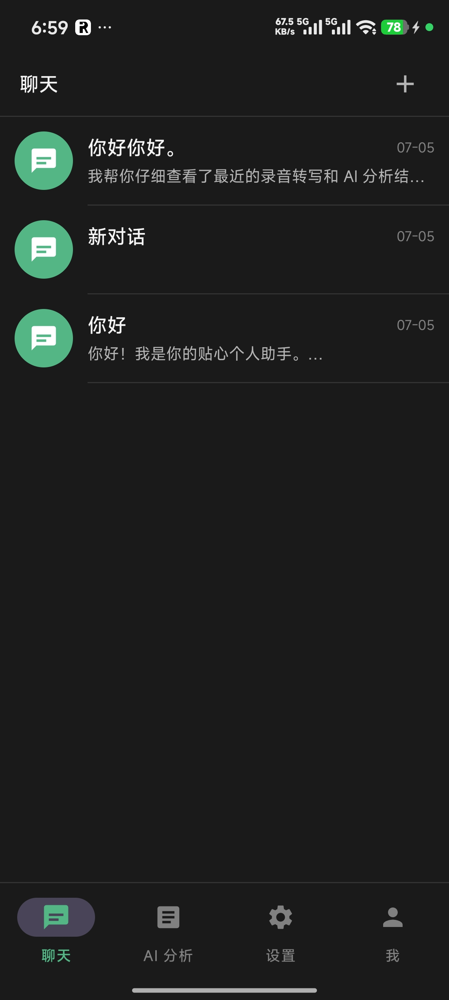
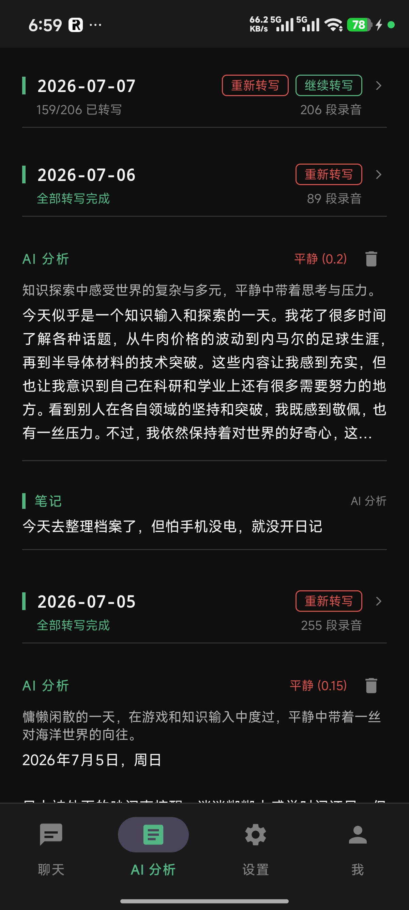
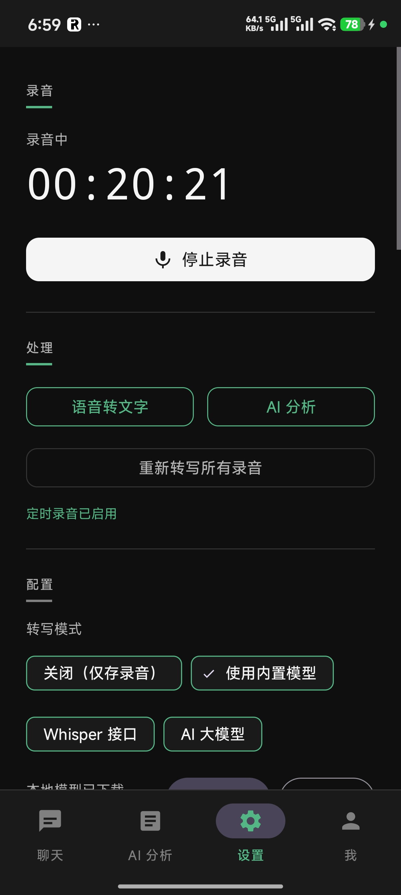
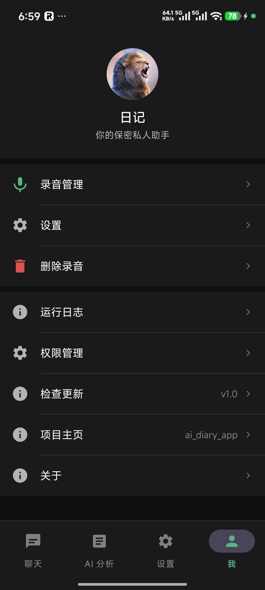

# AI 日记 (AI Diary App)

一款基于 Android 的智能语音日记应用，自动录音、语音转文字、AI 情绪分析与日记生成，支持本地离线模型。

> **[English](README_EN.md)** | **项目主页**: <https://github.com/TS-dinglilu/ai_diary_app>

## 应用截图

| AI 聊天 | AI 分析 | 设置 | 个人中心 |
|:---:|:---:|:---:|:---:|
|  |  |  |  |

- **AI 聊天**：多轮对话，基于录音转写和 AI 分析上下文的智能助手
- **AI 分析**：按日期分组展示转写状态、情绪分析、日记内容，支持手动编写笔记
- **设置**：录音控制、转写模式切换、定时录音、模型管理、备份配置一体化界面
- **个人中心**：录音管理、设置入口、权限管理、版本更新、项目主页

## 功能特性

### 录音
- 自动启动录音，应用打开即开始记录
- AudioRecord + WAV 格式，44 字节头先写入，保证即时可播放
- 每 3 分钟自动分段，最小化数据丢失
- 每 3 秒 fsync 强制写盘并更新 WAV 头
- 麦克风冲突检测（微信语音、通话等）立即停止录音
- 进程被杀时保存当前录音，重启后恢复孤儿文件并开始新录音

### 语音转文字（ASR）
- 支持四种模式：关闭 / 本地离线（sherpa-onnx）/ Whisper / 云端 AI
- 本地离线模式基于 sherpa-onnx（Next-gen Kaldi），无需网络
- 说话人分离支持
- 重新转写 / 继续转写（按日期或单条）

> **建议使用本地离线模式**：语音转文字在本地运行耗电和发热较低，且无需网络，适合长时间持续录音转写。

### AI 分析
- 云端分析：支持 OpenAI 兼容 API
- 本地离线分析：MediaPipe LLM Inference + Gemma-2 2B int8 量化模型（~1.8GB）
- 生成情绪评分、摘要、日记内容
- 按日期聚合展示

> **建议使用云端模型**：本地离线 AI 分析基于 Gemma-2 2B 大模型推理，运行时耗电量和发热巨大，不适合频繁使用。云端模型响应更快、效果更好且不消耗设备资源。

### AI 分析界面
- 日期分组，两行头部布局（日期+操作 / 转写状态+录音数）
- 重新转写（红色）、继续转写（绿色）按钮
- 转写状态实时显示：正在转写 / 全部完成 / 部分完成
- 点击转写或分析内容进入详情页查看完整内容
- 详情页可编写笔记，笔记独立展示不受日期折叠影响
- 设置中可切换默认折叠/展开录音

### AI 聊天
- 基于上下文的多轮对话
- 支持云端和本地离线模型

### 定时录音
- 自定义自动开始/停止时间（如 7:30 开始、23:00 停止）
- 基于 AlarmManager 精确触发，设备重启后自动恢复

### 数据备份与恢复
- **坚果云 WebDAV 云备份**：备份转写文字、AI 分析结果、笔记、聊天记录、设置（不含音频和模型文件）
- **本地 ZIP 备份**：选择文件夹，将数据打包为 ZIP 压缩包
- **从云端恢复** / **从本地恢复**：一键恢复数据
- 打开软件时自动备份到坚果云（可关闭）
- 充电时自动云端备份（可关闭）

### 深色模式
- Material Design 3 深色主题
- 浅色/深色/跟随系统三种模式
- 深色模式配色专门优化，对比度高、层次分明

### GitHub 自动更新
- 后台静默检查 GitHub Releases 最新版本
- 有新版本时在"检查更新"旁显示绿色提示文字
- 用户点击后弹窗确认，下载时显示进度对话框

## 下载

| 来源 | 地址 | 备注 |
|------|------|------|
| GitHub Release | [Releases](https://github.com/TS-dinglilu/ai_diary_app/releases) | 国际网络 |
| 国内下载（夸克网盘） | https://pan.quark.cn/s/559ce2bc5b5b?pwd=yx2N | 提取码: `yx2N` |

## 重要：后台运行设置

为保证应用在后台持续录音不被系统杀死，请务必进行以下设置：

1. **开启自启动**：允许应用开机自启动，设备重启后可自动恢复录音
2. **省电策略：无限制**：将电池优化设为"无限制"（或"不限制"），防止系统杀掉后台录音服务
3. **锁定应用**：在最近任务列表中锁定本应用，防止被一键清理

> 以上设置在国产 ROM（MIUI、EMUI、ColorOS、OriginOS 等）上尤为重要，这些系统的后台管理较为激进。

## 测试设备

本应用在**小米 15** 上测试通过。如果在其他设备上遇到 bug 或兼容性问题，欢迎在 [Issues](https://github.com/TS-dinglilu/ai_diary_app/issues) 中反馈。

## 技术栈

| 类别 | 技术 |
|------|------|
| 语言 | Kotlin |
| 架构 | MVVM + Room + ViewBinding |
| 录音 | AudioRecord + WAV |
| 语音转文字 | sherpa-onnx (本地) / Whisper (本地) / 云端 API |
| AI 分析 | MediaPipe LLM Inference 0.10.14 (本地) / 云端 API |
| 本地模型 | Gemma-2 2B int8 量化 |
| 数据库 | Room (SQLite) |
| 后台任务 | WorkManager |
| UI | Material Design 3 |

## 项目结构

```
ai_diary_app/
├── app/
│   └── src/main/
│       ├── assets/
│       │   ├── sherpa/          # 语音转文字模型（运行时在线下载）
│       │   │   ├── sense-voice.onnx
│       │   │   └── tokens.txt
│       │   └── llm/             # 本地离线 AI 分析模型（运行时在线下载）
│       │       └── gemma-2b-it.bin
│       └── java/com/example/ailogapp/
│           ├── ai/              # AI 分析与 LLM 推理
│           ├── data/            # Room 数据库、Entity、DAO
│           ├── fragment/        # Fragment（聊天、分析、设置）
│           ├── service/         # 录音服务
│           ├── ui/              # RecyclerView Adapter、数据项
│           ├── util/            # 工具类（PrefsManager、FileUtils 等）
│           └── worker/          # WorkManager 后台任务
├── pictures/                    # 应用截图
├── gradle/
├── settings.gradle.kts
└── build.gradle.kts
```

## 快速开始

### 环境要求
- Android Studio
- JDK 17+
- Android SDK 34（targetSdk）
- minSdk 26

### 构建
```bash
./gradlew assembleDebug
```

### 模型文件

模型不打包在 APK 中，首次使用时通过在线下载，减小安装包体积：

| 模型 | 用途 | 下载位置 | 大小 |
|------|------|---------|------|
| sense-voice.onnx | 语音转文字 | [ModelScope](https://www.modelscope.cn/models/dingliu/ai_diary_app) | ~937MB |
| gemma-2b-it.bin | 本地离线 AI 分析 | [ModelScope](https://www.modelscope.cn/models/dingliu/ai_diary_app) | ~1.8GB |

> 下载地址：https://www.modelscope.cn/models/dingliu/ai_diary_app
>
> 在设置界面填写模型下载链接后，App 会自动下载并安装模型到应用私有目录（filesDir）。两个模型合计需要约 2.7GB 存储空间。

## 配置说明

| 配置项 | 说明 |
|--------|------|
| 转写模式 | 关闭 / 本地离线 / Whisper / 云端 AI |
| AI 分析模式 | 云端 / 本地离线 |
| 自动转写 | 充电时自动触发 |
| 自动分析 | 充电时自动触发 |
| 自动删除 | 超过 N 天的录音文件自动删除（保留文字） |
| 默认折叠 | AI 分析页日期默认折叠录音条目 |
| 深色模式 | 浅色 / 深色 / 跟随系统 |
| 定时录音 | 自定义自动开始/停止时间 |
| 坚果云备份 | WebDAV 地址/邮箱/密钥配置 |
| 本地备份 | 选择文件夹导出 ZIP |
| 启动自动备份 | 打开软件时自动备份到坚果云 |
| 模型链接 | ASR / LLM 模型下载链接（GitHub Release 直链） |

## 依赖的第三方库

- [sherpa-onnx](https://github.com/k2-fsa/sherpa-onnx) - 语音识别
- [MediaPipe LLM Inference](https://ai.google.dev/edge/mediapipe/solutions/genai/llm_inference) - 本地大模型推理
- Room - 数据库
- WorkManager - 后台任务
- Material Components for Android - UI 组件

## License

MIT
